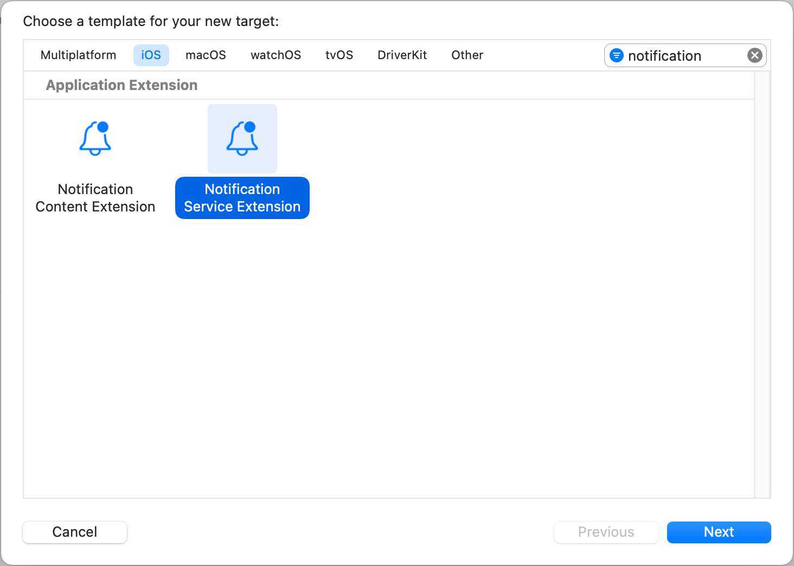

## Amplify Swift Utilities for Notifications

[](https://codecov.io/gh/aws-amplify/amplify-swift-utils-notifications)

Amplify Swift Utilities for Notifications provides helpful functionality for working with push notifications on iOS and macOS.

Although it was developed for use with AWS Amplify, it can also be used independently.


[API Documentation](https://aws-amplify.github.io/amplify-swift-utils-notifications/docs/)


## Features

- Convenience methods to support requesting notification permissions and registering with APNs
- Push Notification Service extension to support fetching and attaching remote media to notifications


## Platform Support
Amplify Swift Utilities for Notifications package supports iOS 13+ and macOS 10.15+.


## License

This package is licensed under the Apache-2.0 License.


## Installation

This package requires Xcode 13.4 or higher to build.


### Swift Package Manager
1. Swift Package Manager is distributed with Xcode. To start adding this package to your iOS project, open your project in Xcode and select **File > Add Packages**.
    

2. Enter the package GitHub repo URL (https://github.com/aws-amplify/amplify-swift-utils-notifications) into the search bar.

3. You'll see the repository rules for which version you want Swift Package Manager to install. Choose **Up to Next Major Version** and enter **1.0.0** as the minimum version for the Dependency Rule, then click **Add Package**.
    

4. Select `AmplifyUtilsNotifications`, then click Add Package.

5. In your app code, explicitly import the plugin as needed.

    ```swift
    import SwiftUI
    import AmplifyUtilsNotifications

    @main
    struct HelloWorldApp: App {
        @UIApplicationDelegateAdaptor(AppDelegate.self) var appDelegate
        var body: some Scene {
            WindowGroup {
                ContentView()
            }
        }
    }

    class AppDelegate: NSObject, UIApplicationDelegate {
        func applicationDidFinishLaunching(_ application: UIApplication) {
            Task {
                let isPushNotificationAllowed = await AmplifyUtilsNotifications.AUNotificationPermissions.allowed
                // ...
            }
        }
    }
    ```

### Cocoapods
1. This package is also available through [CocoaPods](https://cocoapods.org/). If you have not installed CocoaPods, follow the instructions [here](https://guides.cocoapods.org/using/getting-started.html#getting-started).

2. Add the package as a dependency to your Podfile.
    ```ruby
    platform :ios, '13.0'
    use_frameworks!

    target 'HelloWorldApp' do
        pod 'AmplifyUtilsNotifications', '~> 1.0.0'
    end
    ```

3. Then run the following command:
    ```sh
    pod install
    ```

4. Open up *.xcworkspace with Xcode, and you will be able to use the `AmplifyUtilsNotifications` package in your project.

## Notification Service Extension for AWS Pinpoint

This package includes a ready to use implementation(`AUNotificationService`) for handling remote notifications sent by AWS Pinpoint. It helps with decoding notification json data and retrieving the remote media url as an attachment.

#### Push notification in AWS Pinpoint format
1. Add a Service App Extension to Your Project. [Apple Doc](https://developer.apple.com/documentation/usernotifications/modifying_content_in_newly_delivered_notifications).

    

2. Update `info.plist` of the newly created Notification Service Extension.

    ```xml
    <dict>
        <key>NSExtension</key>
        <dict>
            <key>NSExtensionPointIdentifier</key>
            <string>com.apple.usernotifications.service</string>
            <key>NSExtensionPrincipalClass</key>
            <string>AmplifyUtilsNotifications.AUNotificationService</string>
        </dict>
    </dict>
    ```

    > Note:
    >
    > We suggest you either keep the auto generated `NotificationService.swift` source file or add an empty swift file for your Notification Service Extension target. An empty source list will cause an error when you try to install the extension to a real device.

### Push notification not in AWS Pinpoint format

You can also subclass `AUNotificationService` to support a different notification payload format or add custom functionality.

For example, we want to send the push notification with a field name `video_url`.

1. Define a `MyPayload` struct that conforms to the `AUNotificationPayload` protocol. It defines the `remoteMediaURL`.

2. Subclass `AUNotificationService` and change the `payloadSchema` property to `MyPayload` that was defined in the previous step.

    ```swift
    import AmplifyUtilsNotifications

    struct MyPayload: AUNotificationPayload {
        var remoteMediaURL: String? {
            video_url
        }

        let video_url: String
    }

    class NotificationService: AUNotificationService {

        override init() {
            super.init()
            self.payloadSchema = MyPayload.self
        }
    }
    ```

3. Update the `info.plist` by setting `NSExtensionPrincipalClass` to `$(PRODUCT_MODULE_NAME).NotificationService`.

You can also override the `didReceive` function to modify the content as desired. For example, attach suffix `[MODIFIED]` to your notification title.

```swift
override func didReceive(
    _ request: UNNotificationRequest,
    withContentHandler contentHandler: @escaping (UNNotificationContent) -> Void
) {
    super.didReceive(request) { content in
        self.contentHandler = contentHandler
        let mutableContent = content.mutableCopy() as? UNMutableNotificationContent
        mutableContent?.title = content.title + "[MODIFIED]"
        if let mutableContent {
            contentHandler(mutableContent)
        }
    }
}
```


## Reporting Bugs/Feature Requests

[](https://github.com/aws-amplify/amplify-swift-utils-notifications/issues?q=is%3Aissue+is%3Aopen+label%3Abug)
[](https://github.com/aws-amplify/amplify-swift-utils-notifications/issues?q=is%3Aissue+label%3A%22question%22+is%3Aopen+)
[](https://github.com/aws-amplify/amplify-swift-utils-notifications/issues?q=is%3Aissue+label%3A%22feature-request%22+is%3Aopen+)
[](https://github.com/aws-amplify/amplify-swift-utils-notifications/issues?q=is%3Aissue+is%3Aclosed+)

We welcome you to use the GitHub issue tracker to report bugs or suggest features.

When filing an issue, please check [existing open](https://github.com/aws-amplify/amplify-swift-utils-notifications/issues), or [recently closed](https://github.com/aws-amplify/amplify-swift-utils-notifications/issues?utf8=%E2%9C%93&q=is%3Aissue%20is%3Aclosed%20), issues to make sure somebody else hasn't already
reported the issue. Please try to include as much information as you can. Details like these are incredibly useful:

* Expected behavior and observed behavior
* A reproducible test case or series of steps
* The version of our code being used
* Any modifications you've made relevant to the bug
* Anything custom about your environment or deployment
